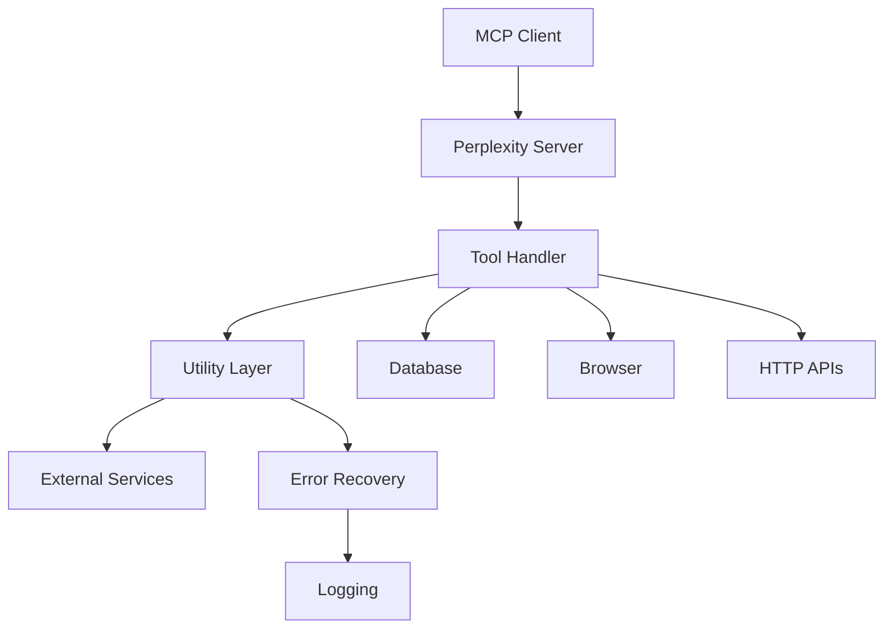

# Architecture Guide

Perplexity features a **clean modular architecture** designed for maintainability and testability.

## Directory Structure

```
src/
├── main.ts                       # Entry point
├── server/                       # MCP server implementation
│   ├── PerplexityServer.ts      # Main server class
│   ├── config.ts                # Configuration constants
│   ├── toolHandlerSetup.ts      # Tool registration
│   └── modules/                 # Core server modules
│       ├── SearchEngine.ts      # Search functionality module
│       ├── DatabaseManager.ts   # Database operations module
│       ├── BrowserManager.ts    # Browser automation module
│       └── __tests__/           # Module-specific comprehensive tests
│           ├── SearchEngine.test.ts    # 20 tests, 90%+ coverage
│           └── DatabaseManager.test.ts # 28 tests, 85%+ coverage
├── tools/                        # Individual tool handlers
│   ├── search.ts                # Perplexity search
│   ├── chatPerplexity.ts        # Conversational AI
│   ├── extractUrlContent.ts     # Content extraction
│   ├── getDocumentation.ts      # Documentation search
│   ├── findApis.ts              # API discovery
│   └── checkDeprecatedCode.ts   # Deprecation analysis
├── utils/                        # Shared utilities
│   ├── db.ts                    # SQLite operations
│   ├── logging.ts               # Structured logging
│   ├── puppeteer.ts             # Browser automation
│   ├── extraction.ts            # Content processing
│   └── fetch.ts                 # HTTP operations
├── schema/                       # Tool schemas
│   └── toolSchemas.ts           # MCP tool definitions
└── types/                        # TypeScript definitions
    └── index.ts                 # Shared types
```

## Key Design Principles

- **Separation of Concerns**: Each module has a single responsibility
- **Dependency Injection**: Clean interfaces between components
- **Error Recovery**: Multi-level fallback strategies
- **Type Safety**: Comprehensive TypeScript coverage
- **Testability**: Every module designed for unit testing with established patterns

## Component Responsibilities

### Server Layer (`src/server/`)

- **PerplexityServer.ts**: Main MCP server implementation
  - Tool registration and lifecycle management
  - Request/response handling
  - Error boundaries and logging

- **modules/**: Core functionality modules
  - **SearchEngine.ts**: Perplexity search orchestration with comprehensive error handling
  - **DatabaseManager.ts**: SQLite operations with lifecycle management
  - **BrowserManager.ts**: Puppeteer browser automation with recovery procedures

- **config.ts**: Centralized configuration
  - Timeout values and retry policies
  - Browser automation settings
  - Environment-specific overrides

- **toolHandlerSetup.ts**: Tool registration
  - Maps tool names to handler functions
  - Provides tool metadata and schemas
  - Handles tool-specific configuration

### Tools Layer (`src/tools/`)

Each tool handler is self-contained with:

- Input validation and sanitization
- Business logic implementation
- Error handling and recovery
- Response formatting

### Utilities Layer (`src/utils/`)

- **db.ts**: Database operations
  - SQLite connection management
  - Chat history persistence
  - Transaction handling

- **logging.ts**: Structured logging
  - Consistent log formatting
  - Metadata attachment
  - Error context preservation

- **puppeteer.ts**: Browser automation
  - Headless browser management
  - Anti-detection measures
  - Resource cleanup

- **extraction.ts**: Content processing
  - HTML parsing and cleaning
  - Text extraction algorithms
  - Quality validation

- **fetch.ts**: HTTP operations
  - Request standardization
  - Error classification
  - Response processing

## Data Flow Architecture



## Error Handling Strategy

### Multi-Level Recovery

1. **Tool Level**: Input validation, business logic errors
2. **Utility Level**: Network failures, timeout handling
3. **Server Level**: Catastrophic failures, resource cleanup
4. **Protocol Level**: MCP compliance, client communication

### Error Classification

- **Recoverable**: Retry with backoff, fallback mechanisms
- **User Error**: Clear feedback, input validation
- **System Error**: Logging, monitoring, graceful degradation
- **Fatal**: Clean shutdown, resource cleanup

## Performance Considerations

### Resource Management

- **Browser Instances**: Pooled and reused when possible
- **Database Connections**: Single connection with WAL mode
- **Memory Usage**: Explicit cleanup, garbage collection hints
- **Concurrent Operations**: Limited parallelism to prevent resource exhaustion

### Caching Strategy

- **Content Extraction**: Minimize redundant browser automation
- **Database Queries**: Prepared statements and indices
- **Configuration**: Loaded once at startup

## Security Architecture

### Input Validation

- **Tool Arguments**: Schema validation (planned Zod integration)
- **URL Safety**: Protocol and domain validation
- **Content Sanitization**: XSS prevention, content filtering

### Browser Security

- **Sandboxing**: Isolated browser contexts
- **Resource Limits**: Memory and CPU constraints
- **Network Controls**: Request filtering and monitoring

### Data Protection

- **Local Storage**: No external data transmission
- **Encryption**: Database encryption at rest (planned)
- **Access Control**: File system permissions

## Extensibility Points

### Adding New Tools

1. Create handler in `src/tools/yourTool.ts`
2. Add schema to `src/schema/toolSchemas.ts`
3. Register in `src/server/toolHandlerSetup.ts`
4. Add tests in `src/tools/__tests__/yourTool.test.ts`
5. Update types in `src/types/index.ts`

### Configuration Extension

- Environment-specific configs in `src/server/config.ts`
- Runtime configuration via environment variables
- Tool-specific settings in handler files

### Utility Extension

- Shared functionality in `src/utils/`
- Consistent error handling patterns
- Type-safe interfaces

## Testing Architecture

### **Comprehensive Module Testing**

The server modules feature comprehensive test coverage with established patterns:

- **SearchEngine.ts**: 20 tests covering public API, private methods, and error scenarios
- **DatabaseManager.ts**: 28 tests covering full lifecycle, error handling, and state management
- **Testing Patterns**: TypeScript interface testing, Vitest mocking, lifecycle validation

### **Testing Infrastructure**

```
src/
├── __tests__/integration/        # System-level tests
├── server/
│   ├── modules/__tests__/        # Module-specific comprehensive tests
│   │   ├── SearchEngine.test.ts  # Private method testing, error boundaries
│   │   └── DatabaseManager.test.ts # State management, mock database testing
│   └── __tests__/                # Server configuration tests
├── tools/__tests__/              # Tool handler tests
└── utils/__tests__/              # Utility function tests
```

### **Mock Strategy**

- **Database Mocking**: better-sqlite3 with vi.hoisted() patterns
- **Browser Mocking**: Complete IBrowserManager interface implementation
- **Interface Testing**: TypeScript interfaces for private method access
- **Error Boundary Testing**: Both Error objects and string error scenarios

---
*Last updated: May 23, 2025*
